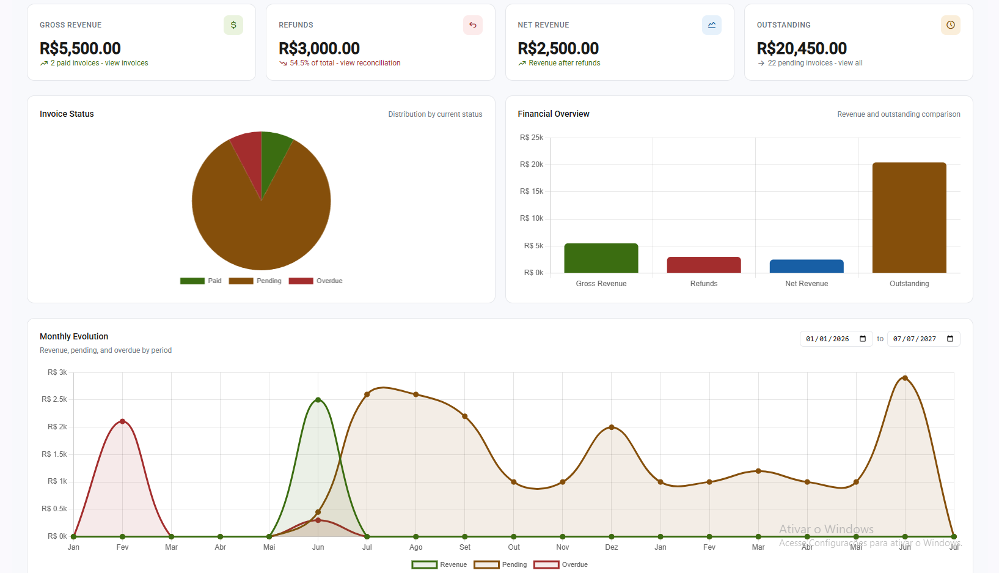
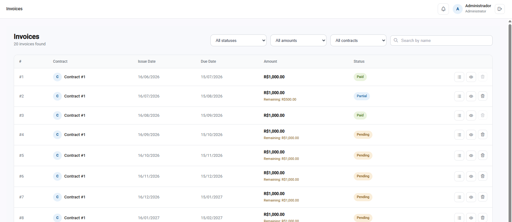
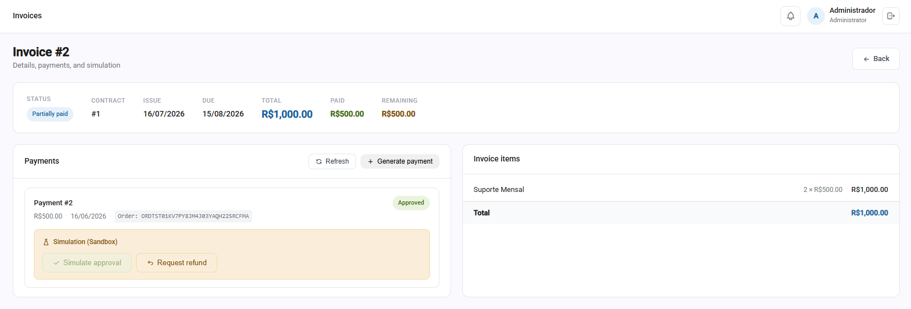
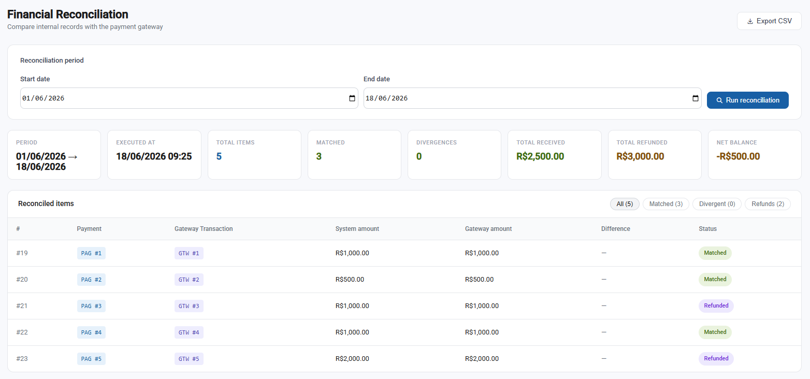
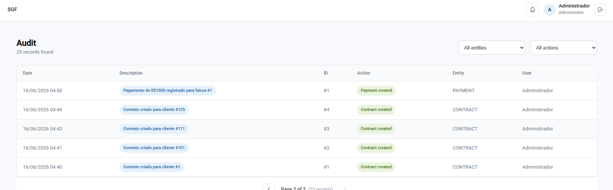

# SGF — Financial Management System


> A B2B SaaS web system for financial management of recurring service contracts, built as a university capstone project.

---

## Overview

SGF automates the complete financial cycle of service companies: contract management, automatic invoice generation, PIX payment processing via Mercado Pago, refund workflows, financial reconciliation, and managerial dashboards — all in a single platform.

---

## Features

- **Contract Management** — register clients and service contracts with configurable billing periods (monthly, quarterly, semiannual, annual)
- **Automatic Invoice Generation** — invoices generated automatically based on contract billing cycles
- **PIX Payments via Mercado Pago** — full integration with Mercado Pago Orders API, QR code generation and async webhook handling
- **Partial Payments** — support for partial invoice payments with real-time remaining balance tracking
- **Late Fees & Interest** — automatic calculation of fines and daily interest based on configurable financial parameters
- **Refund Workflow** — analyst requests refund → manager approves or rejects → gateway processes
- **Financial Reconciliation** — compares internal records with gateway data, exports CSV report
- **Managerial Dashboard** — revenue, refunds, pending invoices, overdue clients, monthly charts
- **Audit Log** — every sensitive operation is logged with user, timestamp and description
- **Role-Based Access Control** — Admin, Financial Manager and Financial Analyst roles with scoped permissions
- **Notifications** — in-app alerts for upcoming invoice due dates and refund status changes

---

## Tech Stack

| Layer | Technology |
|---|---|
| Backend | Java 21, Spring Boot 4, Spring Security, Spring Data JPA |
| Frontend | Angular 17 (standalone components) |
| Database | MySQL 8 with Flyway migrations |
| Auth | JWT (JJWT 0.11.5) |
| Payment Gateway | Mercado Pago Orders API |
| Infrastructure | Docker, Docker Compose |
| API Docs | SpringDoc OpenAPI 3 (Swagger UI) |

---

## Screenshots

### Dashboard


### Invoices


### PIX Payment


### Financial Reconciliation


### Audit Log


---

## Getting Started

### Prerequisites

- Docker and Docker Compose installed
- A Mercado Pago sandbox account ([create here](https://www.mercadopago.com.br/developers))

### Setup

**1. Clone the repository**
```bash
git clone https://github.com/Raul-guii/Financial-Management-System
cd Financial-Management-System
```

**2. Create the `.env` file** in the project root:
```env
MYSQL_ROOT_PASSWORD=yourpassword
MYSQL_DATABASE=sgf
MYSQL_USER=sgfuser
MYSQL_PASSWORD=yourpassword
MERCADOPAGO_ACCESS_TOKEN=your_sandbox_token
JWT_SECRET=your_jwt_secret_min_32_chars
TZ=America/Sao_Paulo
```

**3. Run**
```bash
docker compose up --build
```

That's it. No local Node.js or Java installation required.

### Access

| Service | URL |
|---|---|
| Frontend | http://localhost:4200 |
| Backend API | http://localhost:8080 |
| Swagger UI | http://localhost:8080/swagger-ui/index.html *(local only)* |
| phpMyAdmin | http://localhost:8081 |

### Default credentials

> All users created via seed have the default password: `12345678`

### ⚠️ Important — Mercado Pago Sandbox

This project uses Mercado Pago in **sandbox mode**. To process a PIX payment successfully:

- The payer email **must end with** `@testuser.com` (e.g. `payer@testuser.com`)
- Any other email will cause the payment to fail on the gateway side
- The QR code and ticket URL generated are for sandbox only and cannot be paid with a real PIX app

To simulate a payment approval, use the Mercado Pago sandbox webhook or wait for the sandbox to auto-approve.

> ⚠️ Change these before any production use.

---

## API Documentation

Interactive API docs available at `http://localhost:8080/swagger-ui/index.html` after running the project.

All endpoints are documented automatically via SpringDoc OpenAPI — no external tools required.

---

## Architecture

┌─────────────┐     HTTP/REST      ┌──────────────────┐

│   Angular   │ ────────────────▶  │   Spring Boot    │

│  Frontend   │ ◀────────────────  │     Backend      │

└─────────────┘        JWT         └────────┬─────────┘

│

     ┌────────────┼────────────┐

     │            │            │

┌────▼────┐  ┌────▼──────┐  ┌──▼────────────┐

│  MySQL  │  │  Flyway   │  │ Mercado Pago  │

│   DB    │  │Migrations │  │     API       │

└─────────┘  └───────────┘  └───────────────┘

---

## License

This project was developed as a university capstone (TCC). Feel free to use it as reference.

